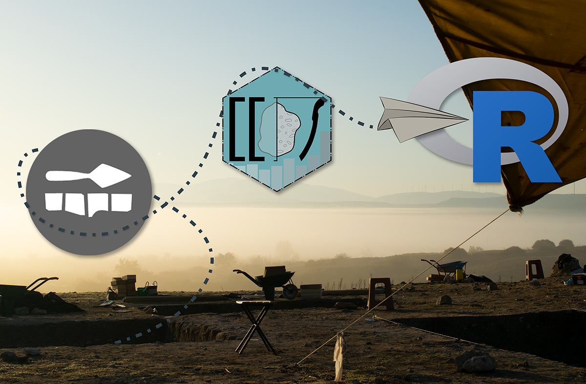

# idaifieldR: Supplement

Supplement (und Text) zum Artikel: "R wie in: Reproduzierbar -- Auswertung von Daten aus Field Desktop mit idaifieldR". Siehe auch [selbes dataset auf iDAI.repo](https://repo.dainst.org/dataset/digitales-supplement-zu-r-wie-in-reproduzierbar).

```
@article{Steinmann2023,
  title = {R wie in: Reproduzierbar -- Auswertung von Daten aus Field Desktop mit idaifieldR},
  author = {Steinmann, Lisa},
  year = {2023},
  url = {https://publications.dainst.org/journals/FdAI/article/view/4146},
  doi = {10.34780/068b-q6c7}
  journal = {Forum für digitale Archäologie und Infrastruktur},
}
```


