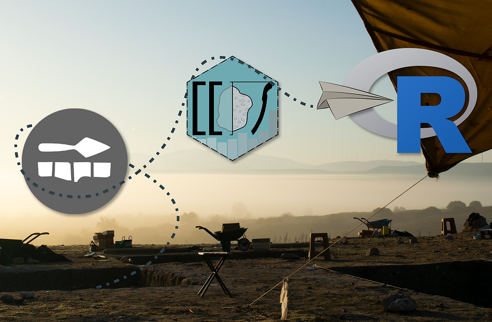
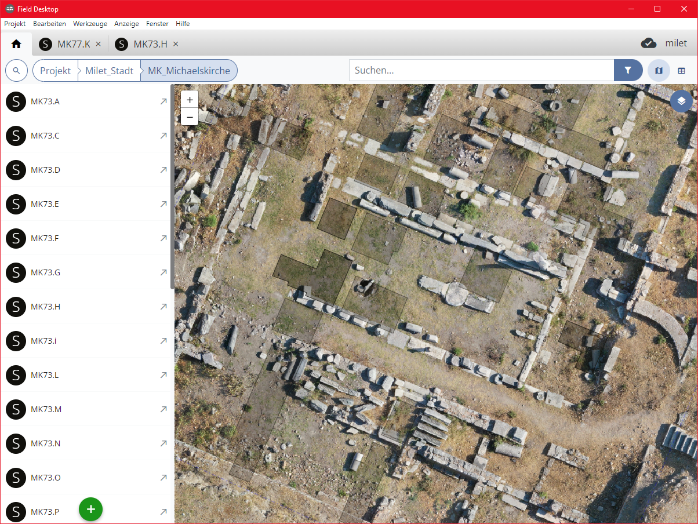

```{r setup, include=FALSE}
library(ggplot2)
library(officedown)
knitr::opts_chunk$set(echo = TRUE,message = FALSE, warning = FALSE)
gridline <- function(color = "grey") {
  res <- element_line(linetype = "dashed", color = color, linewidth = 0.2)
} 
PlotTheme <- theme(legend.justification=c(1,1), 
                   legend.position=c(0.95,0.95), 
                   legend.background = element_rect(fill = "white", 
                                                    colour = "black"),
                   panel.background = element_blank(),
                   axis.text.x = element_text(angle = 45, hjust = 1))
  
  

```


Field Desktop (oder: [iDAI.field](https://field.idai.world/)) ist der Dokumentations-Datenbankclient für Feldforschungsprojekte des DAI und findet auf zahlreichen Ausgrabungen inner- und außerhalb des DAI Anwendung[^1]. Der Client ermöglicht flexible Projektkonfigurationen bei einer in groben Zügen gleichbleibenden Datenstruktur, und ist damit für die unterschiedlichsten archäologischen Projekte geeignet. Der wahre Nutzen von Datenbanken besteht in den Möglichkeiten ihrer Auswertung. Die Stärke einer Datenbank ist es zwar auch, aber nicht nur, das traditionelle, individuelle Notizbuch in eine digitale und kollaborative Form zu überführen, sondern vor Allem Informationen über einzelne Objekte an einem Ort in einer strukturierten und quantitativ erfassbaren Art und Weise nach festgelegten Standards zu bündeln.


[^1]: An dieser Stelle möchte ich dem Team der *Wissenschaftlichen Softwareentwicklung* des DAI, insbesondere Thomas Kleinke, Simon Hohl, Daniel de Oliveira und Juliane Watson, für die immer freundliche Kommunikation und den ausgezeichneten Support danken!

Field Desktop erlaubt mit dem geordneten Export der Daten in csv-Tabellen bereits die vermutlich häufigste Form der Datenauswertung: Das Erstellen von Diagrammen aus Exporten in Tabellenverarbeitungsprogrammen und anderer statistischer Software, wie bspw. SPSS oder PAST. Ein zentraler Kritikpunkt an diesen Programmen ist jedoch ihr inhärenter Status als "black box" und damit einhergehend die Schwierigkeiten, mit ihnen hergestellte Graphiken oder Analysen zu reproduzieren, da ein großer Teil der Arbeit nach dem Export aus dem nur schwer dokumentierbaren Auswählen von Zeilen, Spalten und dem Klicken von Buttons besteht[^2]. Die Statistikprogrammiersprache R bietet die Lösung für dieses Problem, und ist bereits seit langer Zeit in vielen Wissenschaften, die regelmäßig mit statistisch auszuwertenden Daten hantieren, bekannt und beliebt.

[^2]: [@marwickHowComputersBroke2015]

# R wie in: Reproduzierbar

R ist eine Skriptsprache, und lässt sich in einem geeigneten Programm Zeile für Zeile ausführen. Die Arbeit mit R lässt sich dadurch sehr interaktiv gestalten: Wie bei einem Klick in Excel ist bei Bedarf das Ergebnis jeder einzelnen Zeile sofort sichtbar. Dabei garantiert die Verschriftlichung der einzelnen Arbeitsschritte, dass der Weg zum Ergebnis jederzeit nachvollziehbar und vor allem auch beim Hinzufügen neuer Daten sicher und schnell reproduziert werden kann. Für die Verwendung von R in allen archäologischen Disziplinen gibt es zahlreiche Beispiele: David Carlsons "Quantitative Methods in Archaeology Using R" (2017)[^3] integriert zu Beginn eine grundlegende Einführung in R.

[^3]: [@carlsonQuantitativeMethodsArchaeology2017]

Es ist nicht überraschend, dass die meisten Hilfestellungen und Projekte nicht auf gedrucktem Papier, sondern vornehmlich in digitaler Form zu finden sind: Besonders das von Ben Marwick herausgegebene "[How To Do Archaeological Science Using R](https://benmarwick.github.io/How-To-Do-Archaeological-Science-Using-R/index.html)" (2017-ongoing)[^4] bündelt viele Anleitungen und Tipps, und der von selbigem zusammengestellte "[Cran Task View: Archaeology](https://github.com/benmarwick/ctv-archaeology)"[^5] gibt Interessierten schnell zahlreiche Hinweise auf die Möglichkeiten von R und die Bandbreite an archäologischen Projekten, die R verwenden. Marwick setzt sich öffentlichkeitswirksam für die weitere Verbreitung von R und reproduzierbarer Methodik in der Archäologie ein. In einem 2017 erschienenen Artikel demonstriert er die Arbeitsweise und ihre Vorteile anhand einer Fallstudie[^6]. Besonders in der deutschsprachigen Archäologie sind die Arbeitsgemeinschaft [Initiative for Statistical Analysis in Archaeology in Kiel (ISAAK)](https://isaakiel.github.io/)[^7] und ihre Mitglieder nennenswert, die bereits seit 2016 Workshops anbieten und R-Pakete sowie Tools in anderen Programmiersprachen entwickeln.

[^4]: [@marwickHowArchaeologicalScience2017]

[^5]: <https://github.com/benmarwick/ctv-archaeology>

[^6]: [@marwickComputationalReproducibilityArchaeological2017]

[^7]: <https://isaakiel.github.io/>

Als ein Hub für archäologische Projekte und Publikationen, in denen die Verwendung von R eine große Rolle spielt, agiert die auf der CAA 2018 gegründeten special interest group "[Scientific Scripting Languages in Archaeology](https://sslarch.github.io/)"[^8]. Die Publikationen der Mitglieder zeichnen sich durch die Beigabe von Supplementen in Form von Datentabellen, Code-Repositorien oder Erläuterungen aus, wie beispielhaft -- aber keineswegs ausschließlich -- an einigen Beiträgen und GitHub[^9]-Profilen sichtbar wird[^10].

[^8]: <https://sslarch.github.io/>

[^9]: Die Online-Plattform GitHub ist ein weiteres Rad im Getriebe der Reproduzierbarkeit. Obwohl ursprünglich als Versionsverwaltung für Software entstanden, eignen sich git und GitHub als Schnittstelle für kollaborative Projekte sowohl in der Bereitstellung von Daten, als auch der Entwicklung von Tools. Viele Autor\*innen sind dazu übergegangen die Daten und Auswertungsskripte ihrer Artikel oder Projekte auf GitHub oder in Forschungsdatenrepositorien zur Verfügung zu stellen.

[^10]: Siehe bspw.: [@schmidEstimatingHumanMobility2023] (<https://github.com/nevrome>) und [@hinzSensitivityRadiocarbonSum2020] (<https://github.com/MartinHinz>).

# iDAI.field und R?

Mit den Optionen, die der iDAI.field-Mikrokosmos bereits bietet, ist es offensichtlich, dass das DAI die Wichtigkeit dieser Themen erkannt hat, und hier einen Schritt zu mehr Transparenz, Offenheit und Reproduzierbarkeit in der Wissenschaft geht: Field-Datenbanken können bspw. vollständig über [iDAI.field Web](https://field.dainst.org/) publiziert werden und bieten so den direkten Zugriff auf Rohdaten von Ausgrabungen, und auch der Client selbst ist vollständig *Open Source*. Warum nicht den nächsten logischen Schritt anschließen, und auch die Auswertung der Datenbestände transparent und reproduzierbar gestalten?

Die Verwendung von Daten aus Field Desktop / iDAI.field in R ist mit dem Export und Import von Tabellen problemlos möglich. Mit dem manuellen Export existiert hier jedoch erneut ein nicht leicht reproduzierbarer Schritt der Datenauswahl, in dem Kontext und Kategorie der zu exportierenden Daten festgelegt werden können und müssen. Gleichzeitig ist diese Herangehensweise nicht so dynamisch, wie die Auswertung archäologischer Kontexte es manchmal erfordert. Für Zwischenberichte müssen immer wieder neue und doch gleiche Auswertungen aus einem durch Grabungs- und Fundbearbeitungskampagnen regelmäßig aktualisierten Datenbestand erstellt werden. Wenn sich nach weiterer Arbeit an den Befunden der Datenbestand geändert hat, muss erneut der gleiche Export ausgeführt und die alte Datei ersetzt werden.



# idaifieldR!

Das Ziel von idaifieldR ist es, diesen Schritt zu eliminieren und eine flexiblere und dynamischere Auswertung der Datenbank zu ermöglichen. Mit nur wenigen Zeilen lässt sich die gesamte Datenbank oder eine gezielte Auswahl mit idaifieldR in R importieren.


idaifieldR greift dafür auf den CouchDB-Server, den Field Desktop im Hintergrund verwendet, zu. Der direkte Import aus der Datenbank bringt jedoch einige Probleme mit sich: Die Daten -- ursprünglich im JSON-Format, das vielen sicher aus der Verwaltung der Projektkonfigurationen bis zur dritten Version von iDAI.field bekannt ist[^11] -- werden als sog. Liste nach R importiert. Neben dem Import enthält idaifieldR Funktionen, mit denen sich die Daten etwas formatieren und bereinigen lassen, um die Weiterarbeit mit R zu vereinfachen.

[^11]: Zur Erläuterung des Aufbaus der Projektkonfigurationen siehe bspw. in dieser Zeitschrift: [@hamelVomFeldDatenbank2022]

Im Folgenden soll der Workflow mit idaifieldR kurz anhand einiger weniger Beispiele aus [Milet](https://gazetteer.dainst.org/place/2287722) veranschaulicht werden[^12]. Für die Demonstration wird idaifieldR in der Version 0.3.2 verwendet, die [auf GitHub erhältlich](https://github.com/lsteinmann/idaifieldR) ist. Leser\*innen, die bisher noch keine Erfahrung mit R haben, wird empfohlen zunächst R und RStudio zu installieren und sich einige Grundlagen der Sprache anzueignen. Als Hilfestellung sind bspw. die [Screencasts von ISAAKiel](https://isaakiel.github.io/screencasts.html)[^13] oder das Buch „[YaRrr! The Pirate's Guide to R](https://bookdown.org/ndphillips/YaRrr/)"[^14] empfehlenswert. Im Supplement zu diesem Artikel befindet sich neben dem Artikel selbst eine detaillierte Einführung zu idaifieldR, die auch die Installation des Paketes und viele der verfügbaren Funktionen und ihrer Optionen abdeckt.

[^12]: iDAI.field wird seit 2021 von der Miletgrabung verwendet. Informationen zu Nutzung des Datenbankclients im Rahmen der Miletgrabung finden sich in [@steinmann_MiletusDocumentationManual_2023]. Weitere Informationen Milet und den dort laufenden Projekten unter: <https://www.miletgrabung.uni-hamburg.de/>

[^13]: <https://isaakiel.github.io/screencasts.html>

[^14]: [@phillips_YaRrrPirateGuide_2018]

Die Datei, aus der dieser Artikel generiert wurde, ist ein RMarkdown-Bericht. Dieses Format erlaubt es in R Text und Auswertung in einer Datei zu kombinieren, sodass ein gesamter Artikel nach Aktualisierung des Datenbestandes bspw. erneut generiert werden kann. Für alle Plots werden im Artikel nur die nötigsten Zeilen angegeben, während die nähere Gestaltung im Hintergrund passiert. Sie kann in der entsprechenden Datei im Supplement nachgelesen werden.

## Importieren der nötigen Daten

Zunächst verbinden wir uns mit der Datenbank und generieren einen Index, der alle *resources* mit einigen wenigen Angaben enthält, die in der Projektdatenbank existieren[^15]:

[^15]: Als ironischer Twist werden nach den einführenden Worten zu Reproduzierbarkeit die für die Diagramme im Artikel verwendeten Roh-Daten im Supplement nicht mitgeliefert. In diesem Fall ist die unmittelbare Vorlage der dieser Daten leider (noch) nicht möglich, aber für die Funde im Areal der Michaelskirche im Rahmen einer revidierten Version von ([@steinmann_DionysosheiligtumSakrallandschaftMilet_2023]) geplant. Dass es nicht möglich ist, die vollständige Datenbank der Miletgrabung mit diesem Artikel zur Verfügung zu stellen, ist hoffentlich nachvollziehbar.

```{r }
library(idaifieldR)
conn <- connect_idaifield(pwd = "passwort", project = "milet")
index <- get_field_index(conn, verbose = TRUE, gather_trenches = TRUE)
```

Eine *resource* ist ein einzelner Datensatz. Jedes ausgefüllte Formular wird als *resource* gespeichert. Jede *resource* hat eine Kategorie (*category*), die der Art des Formulares entspricht, einen Bezeichner (*identifier*) und eine UUID (im Index: *UID*). Die UUIDs werden in der Datenbank im Hintergrund als Namen einer jeden *resource* verwendet, da sie immer einzigartig sind. Wir können den Index verwenden, um im Folgenden die Datenbank zu filtern oder uns zu helfen, spezielle Anfragen an die Datenbank zu senden. Näheres ist in dem Tutorial zur Verwendung von idaifieldR zu finden, das Teil des Supplementes zu diesem Artikel ist.




Als nächstes importieren wir alle Datensätze aus dem Areal der [Michaelskirche](https://arachne.dainst.org/entity/6525406) aus dem milesischen Datenbankprojekt. In der Struktur der unserer Field-Datenbank benutzen wir die Resource "Ort" als Behältnis für zusammengehörige Schnitte, weswegen wir unseren *query* entsprechend gestalten können:

```{r }
mk_raw <- idf_index_query(conn, uidlist = index,
                          field = "Place",
                          value = "MK_Michaelskirche")
```

Hiermit haben wir nun alle Datensätze aus dem Bereich der [Michaelskirche](https://arachne.dainst.org/entity/6525406) in R zu unserer freien Verfügung. Im Folgenden nehmen wir für viele Schritte das R-Paket [dplyr](https://dplyr.tidyverse.org/) zuhilfe, das die Formatierung und Selektion von Daten erheblich vereinfacht. Wir können die Funktionen von idaifieldR mit dem sog. *Pipe-Operator* aus `dplyr` (und anderen Paketen) benutzen, um die Daten etwas aufzubereiten und leichter nutzbar zu machen:

```{r }
library(dplyr)
mk <- mk_raw %>% 
  simplify_idaifield(uidlist = index) %>%
  idaifield_as_matrix() %>%
  as.data.frame() %>%
  type.convert(as.is = FALSE)
```

Genauere Informationen zu diesem Prozess sind in der Dokumentation sowie in dem Tutorial im Supplement enthalten. Im Grunde endet hiermit die Arbeit von *idaifieldR*. Das Paket dient dazu, die Daten aus Field Desktop nach R zu importieren und aufzubereiten. An den folgenden Beispielen sollen lediglich einige sehr grundlegende Möglichkeiten der Datenauswertung gezeigt werden.

## Das Areal "Michaelskirche"

Im Ort "MK_Michaelskirche" sind alle Schnitte enthalten, die im Areal der [Michaelskirche](https://arachne.dainst.org/entity/6525406) bzw. des [Dionysostempels](https://arachne.dainst.org/entity/6349) angelegt wurden. Hier wurde erstmals unter Theodor Wiegand am Beginn des 20. Jh. gearbeitet. Die Funde in der Datenbank stammen jedoch aus den Grabungen von Wolfgang Müller-Wiener, die er 1973--1977 durchgeführt hat[^16]. Sie wurden zwischen 2017 und 2020 von der Verfasserin dieses Artikels im Rahmen ihrer Dissertation aufgenommen[^17].

[^16]: [@muller-wiener_Milet1977Arbeiten_1979]

[^17]: [@steinmann_DionysosheiligtumSakrallandschaftMilet_2023]; Die Funde wurden vor dem Umstieg der Grabung auf iDAI.field 2 bzw. 3 bearbeitet, weswegen der Import derzeit noch läuft und nicht alle Formulare vollständig ausgefüllt sind. Dennoch ist der Datenbestand geeignet, um ein paar Möglichkeiten der Auswertung mit R zu demonstrieren.

Schnell können wir uns einen Eindruck davon verschaffen, wie viele Funde aus den Schnitten im Areal der Michaelskirche in unserer Datenbank existieren. Dafür benutzen wir die Pakete [ggplot2](https://ggplot2.tidyverse.org/) und [forcats](https://forcats.tidyverse.org/), die uns ansprechendere Graphiken und eine einfachere Datensortierung erlauben:

```{r }
library(ggplot2)
library(forcats)
p <- mk %>% 
  ggplot(aes(x = fct_infreq(relation.isRecordedIn), fill = category)) +
  geom_bar() +
  labs(x = "Schnitt", y = "Anzahl", fill = "Kategorie")
abbnr <- 3
caption <- paste0("Abb. ", abbnr, ": Funde in den einzelnen Schnitten im Areal der Michaelskirche" )
```

```{r echo = FALSE, fig.cap=caption}
p <- p + scale_fill_viridis_d() +
  theme(panel.grid.major.y = gridline("grey70"),
        panel.grid.minor.y = gridline("grey90")) +
  PlotTheme
title_s <- "Funde_Schnitte_MK"
ggsave(file = paste0("../figures/Abb_", abbnr, "_", title_s, ".eps"))
ggsave(file = paste0("../figures/Abb_", abbnr, "_", title_s, ".png"))
p

```

## Keramik aus dem Areal der Michaelskirche

Schauen wir uns also im folgenden an, welche Art von Keramik im Areal der Michaelskirche angetroffen wurde. Hierfür filtern wir den gesamten Datenbestand aus dem Areal der Michaelskirche nach der Kategorie (*category*) "Keramik" (*Pottery*) und lassen ein Balkendiagramm anzeigen, das uns die Keramikklasse (*potteryGroup*) auf der x-Achse und die Anzahl von Datensätzen auf der y-Achse darstellt. Die Farbe symbolisiert dabei die eingetragene Funktionskategorie (*functionalCategory*) eines jeden Keramik-Objektes.

```{r }
p <- mk %>%
  filter(category == "Pottery") %>%
  ggplot(aes(x = fct_infreq(potteryGroup), fill = functionalCategory)) + 
  geom_bar() + 
  labs(x = "Keramikgruppe", y = "Anzahl", fill = "Funktion")
abbnr <- abbnr + 1
caption <- paste0("Abb. ", abbnr, ": Keramik nach Funktion und Gruppe aus dem Areal der Michaelskirche")
```

```{r echo = FALSE, fig.height=7, fig.cap=caption}
p <- p + 
  scale_fill_viridis_d() +
  PlotTheme +
  theme(axis.text.x = element_text(angle = 45, hjust = 1),
        panel.grid.major.y = gridline("gray70"),
        panel.grid.minor.y = gridline("gray90"))

title_s <- "Ker_Funktion_Gruppe_MK"
ggsave(file = paste0("../figures/Abb_", abbnr, "_", title_s, ".eps"))
ggsave(file = paste0("../figures/Abb_", abbnr, "_", title_s, ".png"))
p
```

Neben [Schwarzfirniskeramik](http://thesauri.dainst.org/de/concepts/_1b2c82c9.html), die einen auffällig großen Teil des gesamten Spektrums ausmacht, sehen wir eine eher geringe Menge von [schwarz](http://thesauri.dainst.org/de/concepts/_11bdebc6.html)- und [rotfiguriger](http://thesauri.dainst.org/de/concepts/_d1e3c38b.html) Keramik. Die beiden Gattungen wurden bereits 2016 von [Norbert Kunisch vollständig veröffentlicht](https://zenon.dainst.org/Record/001471948), und die Datensätze geben seine Einschätzungen zu diesen Objekten wider[^18]. Da von ihm publizierte Objekte im Datensatz entsprechend markiert wurden, können wir den Datenbestand schnell dahingehend filtern und uns ein Diagramm der einzelnen Datierungsspannen ausgeben lassen:

[^18]: [@kunischFundeAusMilet2016]

```{r }
p <- mk %>%
  filter(grepl("Kunisch 2016", dating.source)) %>%
  mutate(label = paste0(dating.source, 
                        " (", relation.liesWithin, ")")) %>%
  ggplot(aes(color = potteryGroup)) + 
  geom_linerange(aes(xmin = dating.min, xmax = dating.max, 
                     y = fct_reorder(label, -dating.min)), 
                 linewidth = 2) + 
  labs(x = "Datierung", y = "Katalognummer (und Befund)", color = "Keramikgruppe")
abbnr <- abbnr + 1
caption <- paste0("Abb. ", abbnr, ": Datierungsspannen schwarz- und rotfiguriger Keramik aus dem Areal der Michaelskirche")
```

```{r echo=FALSE, fig.cap=caption, fig.height=10}
p <- p +
  scale_color_manual(values = c("tomato3", "darkslategray")) +
  theme(panel.grid.major.y = gridline("gray90"),
        panel.grid.major.x = gridline("gray70"),
        panel.grid.minor.x = gridline("gray90")) +
  PlotTheme

title_s <- "Datierung_Kunisch_MK"
ggsave(file = paste0("../figures/Abb_", abbnr, "_", title_s, ".eps"))
ggsave(file = paste0("../figures/Abb_", abbnr, "_", title_s, ".png"))
p
```

Es lässt sich schnell beobachten, dass unter den wenigen Fragmenten schwarz- und rotfiguriger Keramik im Areal der Michaelskirche ein Großteil in das 5. Jahrhundert v. Chr. datiert wurde. Sollten in Zukunft neue Fragmente hinzukommen, oder sich die Datierung ändern, ließe sich dieses Diagramm zusammen mit dem gesamten Bericht auf Knopfdruck aus den Daten in Field Desktop neu generieren.

Bei Bedarf kann der gesamte Datensatz oder eine Auswahl bspw. als csv-Tabelle oder in anderen Formaten gespeichert zur Verfügung gestellt werden:

```{r }
mk %>%
  filter(grepl("Kunisch 2016", dating.source)) %>%
  select(identifier, 
         relation.liesWithin, relation.isRecordedIn, 
         potteryGroup, vesselForm, 
         dating.min, dating.max, dating.source) %>%
  write.csv("../data/MK_rf_sf_pottery_Kunisch_2016.csv", fileEncoding = "UTF-8")
```

Die Datei enthält aus allen Datensätzen innerhalb des Ortes "MK_Michaelskirche" in der Datenbank der Miletgrabung in denen "[Kunisch 2016](https://zenon.dainst.org/Record/001471948)" als Quelle für die Datierung angegeben ist wenige grundlegende Informationen: den Bezeichner, den Befund und den Schnitt, die Keramikklasse, die Gefäßform sowie die Datierung und die Katalognummer. Die Tabelle ist im Supplement im entsprechenden Ordner enthalten. Über diesen Weg lassen sich schnell größere Datenmengen auswählen, bereinigen oder umformatieren und erneut nach Field Desktop importieren. Gleichzeitig ist die Möglichkeit, gezieltere Anfragen zu stellen und zu exportieren ggf. für die Beigabe in Publikationen -- wie hier demonstriert -- oder regelmäßigen Arbeitsberichten besonders hilfreich. Bisher ist dies über den csv-Export in Field Desktop ohne umständliches Zusammenfügen mehrerer Tabellen nicht möglich.

## Metadaten

Durch den direkten Zugriff auf die Datenbank haben wir gleichzeitig die Möglichkeit, zu sehen, wer wann an unseren Datensätzen gearbeitet hat. Diese Information lässt sich für jeden einzelnen Datensatz abrufen. Mit der `get_idaifield_docs()`-Funktion können wir alle Datensätze aus der Datenbank importieren. Durch das ausblenden der Legende wird in diesem Fall die Darstellung der Namen aller einzelnen Nutzer\*innen vermieden.

```{r}
mil <- get_idaifield_docs(conn)
date_created <- lapply(mil, function(x) x$doc$created)
date_created <- do.call(bind_rows, date_created)
p <- date_created %>%
  mutate(date = as.Date(date)) %>%
  ggplot(aes(x = date, fill = user)) +
  geom_histogram() + 
  labs(x = "Erstellungsdatum", y = "Anzahl")
abbnr <- abbnr + 1
caption <- paste0("Abb. ", abbnr, ": Nutzung des milet-Datenbankprojektes")
```

```{r echo = FALSE, fig.cap=caption}
p <- p + scale_fill_viridis_d() + 
  theme(panel.grid.major.y = gridline("gray70"),
        panel.grid.minor.y = gridline("gray90")) + 
  PlotTheme + theme(legend.position = "none")
abbnr <- abbnr + 1
title_s <- "Nutzung_milet_db"
ggsave(file = paste0("../figures/Abb_", abbnr, "_", title_s, ".eps"))
ggsave(file = paste0("../figures/Abb_", abbnr, "_", title_s, ".png"))
p
```

Wie zu erwarten werden die meisten Datensätze während der Grabungssaison in den Sommermonaten angelegt. Auf diesem Level scheint es wie Spielerei, aber der Zugriff auf Metadaten kann beim Lösen von Fragen und Problemen, sowie für Arbeitsberichte durchaus hilfreich sein. So lässt sich auch schnell und ohne Aufwand zusammenfassen, wie viele und welche Arten von Funden im Zeitraum einer Grabungskampagne aufgenommen worden sind.

# Potenzial und Weiterentwicklung

Die hier gezeigten Beispiele dienen lediglich als Demonstration, wie schnell sich Ergebnisse aus der Datenbank visualisieren lassen. Mit R und idaifieldR lässt sich das gesamte Potenzial der Projektdatenbanken in iDAI.field ausnutzen. Mit nur wenigen Zeilen Code können die Datensätze importiert, formatiert und visualisiert werden. Mit R ist es möglich, eine Vielzahl von Analysen, die sich besser in Werken zu statistischer Auswertung in der Archäologie unterbringen lassen, als an dieser Stelle, durchzuführen. Darüber hinaus ist R ein mächtiges Werkzeug zum Ausbessern und Bereinigen von unsystematischen Daten. idaifieldR öffnet die Tür für die flexible, quantitative Auswertung und Pflege der Datenbank, sowie für die Publikation ausgewählter Datenbestände.

Bisher wird idaifieldR von der Verfasserin alleine entwickelt und mit dem *milet*-Datenbankprojekt verwendet. Doch um das volle Potenzial von idaifieldR auszuschöpfen und es als nützliches Tool für den Import von Daten aus Field Desktop zu etablieren, ist die Unterstützung und Zusammenarbeit von Interessierten unerlässlich. Wenn sich über diese Plattform Nutzer\*innen finden sollten, die das Paket auch mit anderen Projektkonfigurationen nutzen und testen wollen, wäre das ein großer Gewinn. Erfahrungen und Rückmeldungen von Kolleg\*innen sind für die Weiterentwicklung an diesem Punkt entscheidend. Interessierte sind jederzeit herzlich willkommen über [GitHub](https://github.com/lsteinmann/idaifieldR) an dem Projekt teilzuhaben, oder auch Probleme aufzuzeigen. Nach einer ausgiebigen Testphase, die mit diesem Artikel hoffentlich angestoßen wird, ist das Ziel, das Paket in CRAN, dem offiziellen Repositorium von R, zu veröffentlichen.

# Literatur
